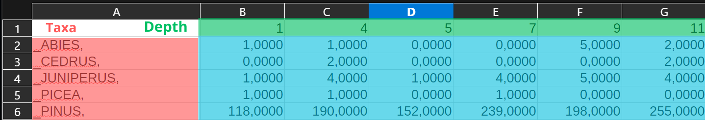

# Software-and-Computing-for-Applied-Physics-Exam

## Introduction

Hi ! I'm Louis Moreau-Brefe, french student in Sorbonne University doing the double master degree MANO with Bologne University. 

In the first semester, I met a group of palaeopalynology students in Sapienza University of Rome : they study fossil pollen distribution and morphology with the aim of reconstructing past vegetational assemblages and climate.

After sampling sediments from stratigraphic cores, they proceed with the microscopical analysis of the sediment with the aim of identifying the presence and abundance of pollen types. Each sample observed corresponds to a specific stratigraphic layer, which is associated to a certain historical period. In order to produce statistically robust data, for each sample it is necessary to observe at least 150-200 pollen grains, leading to a big quantity of data that needs to be evaluated and interpreted in the form of pollen diagrams.

Pollen is the male gametophyte, that is, a microscopic reproductive structure produced by spermatophytes (angiosperms and gymnosperms), which can be dispersed by wind, animals, and water. Their analysis is carried out for each layer of the core. The information obtained from this allows palaeopalynologists to reconstruct the area's vegetation dynamic, and subsequently the climate evolution of that area.

To effectively obtain exploitable data, they perform two main types of graphics : 

    1) Pollinic diagrams 
    2) Rate of Change graphics

Psimpoll is the software that allows them to generate those two statistical structures. But they do not have any control on the parameters of the graphics generated. Usually, they are unreadable and they do not implement a graphical tool for detailed analysis. Therefore, they requested my help to construct a hands-on tool code with Python and Github they could use and modify to manipulate the data. 

## Justification of the project

This project cannot be considered strictly as “applied physics.” Nevertheless, I found it particularly rewarding to have the opportunity to directly contribute to other students’ work. This required me to make my explanations as clear and accessible as possible, and gave real meaning to the concept of the “bus test”: the project should remain understandable and usable by others, even in my absence, as it will need to be continued in the near future.

## Types of data

### Exact format
All the pollinical data will be furnished in Excel files. It will represent the basis of my work. For the tests, I will generate test files that are not effective scientific work. However, at the end of the project, I will use new scientific data to effectively test my work, and compare it to the data generated by Psimpoll. 

ATTENTION : Only a specific type of excel files can be treated, as we can see in the following image : 

The file must simply include : 

- GREEN : the first line corresponds to the depth of the samples
- RED : the first column must contain the names of the species studied
- BLUE : for the other cells, the number represents the quantity of pollen grains found for each specie at the specified layer 

### Why such a format ? 

When measurements are done at the microscope, the idea is to identify with precision the taxa of the pollen observed and to simply count them. Therefore, this format of excel file is the rawest data you can obtain from such an experiment. 

## Pollinic diagrams and Rate of Change (RoC)

### Pollinic diagrams 

Pollinic diagrams are the graphical representation of the abundance of taxa at every depth of a sedimentary core. It is composed of two axis : 
- Axis 1 : Depth of the layer 
- Axis 2 : Percentage of pollen in this layer for the corresponding taxa with respect to the total quantity of pollen

### Rate of Change graphics

## Structure of the project 

Files : 

- In the folder [excel](/workspaces/Software-and-Computing-for-Applied-Physics-Exam/excel), will be compiled all the excell files we used to test the code. 

- In the file [opening](/workspaces/Software-and-Computing-for-Applied-Physics-Exam/opening.py) are compiled the functions of basic treatment for the excel files, meaning : generating the Data Frames and the Python dictionnaries that we will use to generate the graphics. 
More precisely, for each excel we obtain a dictionnary, of which the keys are the taxa and for each taxa corresponds a list of integers. For each dictionnary, we link another list (depth) from which the cells correspond to the depth of the layers where the pollen is found. Thus, the values of the dictionnaries and the depth-list are both arrays of same size.  

- In the file [pollinic](/workspaces/Software-and-Computing-for-Applied-Physics-Exam/pollinic.py), we will find the functions that use the Data Frames generated by the opening functions : percentage convert the row data of each sampling into the percentage of abundance of a taxa in a specific layer, single_pollinic_diag generates a pollinic  diagram for each ploting page and general_pollinic_diag reuse single_pollinic_diag ploting strategy to generate the diagrams in a compiled way that allows easily there comparaison.

- The file [configuration](/workspaces/Software-and-Computing-for-Applied-Physics-Exam/configuration.txt) is a Jupyter Notebook that condensate all the simple test to verify the good functionning of both pollinic.py and roc.py functions. 

- In the file [roc](/workspaces/Software-and-Computing-for-Applied-Physics-Exam/roc.py), we will find the functions that enable the statistical process to obtain the Rate of Change graphics.

- The file [testing](/workspaces/Software-and-Computing-for-Applied-Physics-Exam/testing.ipynb) is a Jupyter Notebook that condensate all the simple test to verify the good functionning of both pollinic.py and roc.py functions. 

- In the folder [results](/workspaces/Software-and-Computing-for-Applied-Physics-Exam/results) are compiled all the interesting data ploted in the testing.ipynb file. 

## Some results

### Pollinic diagrams 

For the pollinic diagrams, we obtain the following data, based on a real pollen sampling in the Thau lagoon, France :

- Here is a part of the grpahics generated : we can see that we obtain a high variability on the presence of diverse pollen taxa, that we can compare the abundance and deduce environmental influencing factors such as climate abrupt changing, human presence...

- Here is a focus on two the specific cases : Pinus's presence is deeply link to the presence of human agglomeration. Oftenly, it inrease is a good marker of soil artifizialition. Instead, in the case of the Thau Lagoon, the decreasing presence of Vitus pollen is linked to the changement of economy in the region during the second half of the XXth century : 

